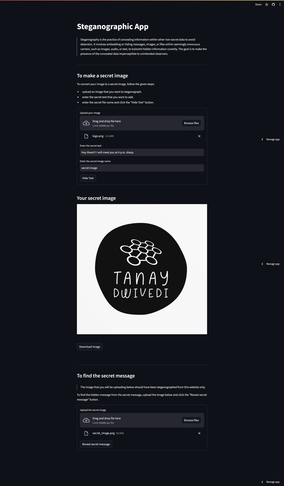
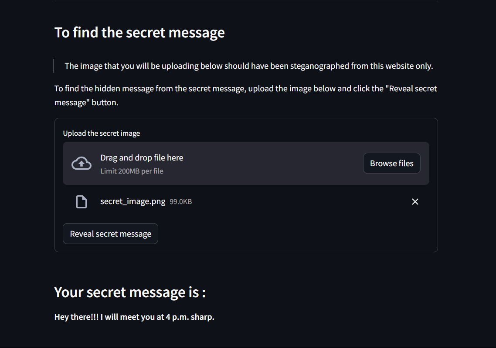

# Steganographic App

[Link to the website](https://steganographic-app.streamlit.app)

This app, developed using Streamlit, is a powerful **Steganographic tool** designed for the seamless concealment and extraction of **secret messages** within image files. Employing the **Least Significant Bit (LSB) technique**, users are empowered to encode and decode information covertly, enhancing the privacy and security of their digital communication. The straightforward interface ensures that users can effortlessly engage in two fundamental operations: hiding a confidential message within an image and revealing concealed information from a steganographed image.

In the first mode, users upload an image, input their **secret text**, and assign a unique name for the steganographed image. The app then adeptly converts the secret message into its **binary representation** and embeds it discreetly within the least significant bits of the image pixels. This results in the creation of a new image, effectively concealing the sensitive information.

In the second mode, users can upload a steganographed image, and by activating the **Reveal secret message** feature, the app deftly extracts and decodes the hidden binary data, unveiling the original message. Notably, the app prioritizes user-friendly interactions and incorporates robust error handling to guide users in case of incorrect file formats or potential misuse of its capabilities.

Overall, this Steganographic App stands as a versatile and accessible tool for users seeking to explore the intricacies of steganography within the context of image files.

-----

## Installation

```
pip install streamlit
```
```
pip install stegano
```
```
pip install pillow
```
Firstly import the `streamlit`, `stegano` and `pillow` libraries through the terminal that will help in the program.

-----

## How to run:

Download the zip file and extract the files. Then open your terminal or command prompt, navigate to the directory where the `main.py` python file is saved, and run the following command:

```
streamlit run main.py
```

-----

## Aim of the Project:

1. **Educational Focus:**
   The project aims to educate users about steganography by providing a hands-on experience in hiding and revealing secret messages within images.

2. **Implementation of LSB Technique:**
   Focusing on the practical application of the Least Significant Bit (LSB) technique, the project demonstrates how this method can be used for secure information concealment.

3. **User-Friendly Interface and Error Handling:**
   Prioritizing user experience, the project offers a streamlined interface for easy interaction, coupled with robust error handling to guide users through the steganographic processes.

-----

## Advantages:

1. **Security Enhancement:**
   Steganography provides a means to enhance digital security by hiding sensitive information within seemingly innocent carriers, such as images or audio files. This can be advantageous in scenarios where traditional encryption methods may be susceptible to detection.

2. **Covert Communication:**
   One of the primary advantages of steganography is its ability to enable covert communication. By embedding messages within media files, users can communicate discreetly without drawing attention to the existence of hidden information.

3. **Diverse Application:**
   Steganography finds application in various fields, including digital forensics, copyright protection, and secure data transmission. Its versatility makes it a valuable tool for professionals seeking to safeguard information in different contexts.

-----

## Disadvantages & Limitations:

1. **Detection Challenges:**
   The chief limitation of steganography is its susceptibility to detection. While it aims to conceal information, sophisticated detection tools and algorithms can be employed to identify hidden data. This poses a significant disadvantage in scenarios where the concealment of information is critical.

2. **Lossy Compression Impact:**
   Steganography can be negatively impacted by lossy compression techniques commonly applied to multimedia files. Compression algorithms may alter or discard data during the compression process, potentially leading to the loss of hidden information and reducing the effectiveness of steganographic methods.

3. **Limited Capacity for Payload:**
   The amount of data that can be concealed using steganography is limited by the carrier file's size and format. This limitation may restrict the use of steganography for large-scale or high-volume data concealment, making it less suitable for certain applications.

-----

## Future Improvements:

1. **Exploration of Advanced Techniques:**
   Investigate and implement advanced steganographic methods beyond LSB for enhanced security.

2. **Machine Learning-Based Countermeasures:**
   Develop countermeasures using machine learning to dynamically adapt hiding strategies against evolving detection methods.

3. **Increased Payload Capacity:**
   Overcome limitations in payload capacity, especially for large data sets, to broaden steganography's applicability.

4. **Dynamic Payload Adjustment:**
   Implement mechanisms for dynamically adjusting the amount of hidden information based on carrier file characteristics.

5. **Integration with Emerging Technologies:**
   Explore integration with emerging technologies like blockchain for innovative and secure steganographic communication.

-----

## Technologies Learned:

The technologies involved in the provided Steganographic App include:

1. **Streamlit:**
   Utilized for creating a user-friendly web interface, Streamlit simplifies the development of interactive and visually appealing applications without extensive coding.

2. **Stegano:**
   The Stegano library is employed for implementing steganography, specifically the Least Significant Bit (LSB) technique, enabling the hiding and revealing of secret messages within image files.

3. **PIL (Python Imaging Library):**
   PIL, now known as the Pillow library, is used for handling image files. In this context, it assists in opening, manipulating, and saving images during the steganographic processes.

-----

## Output:





-----